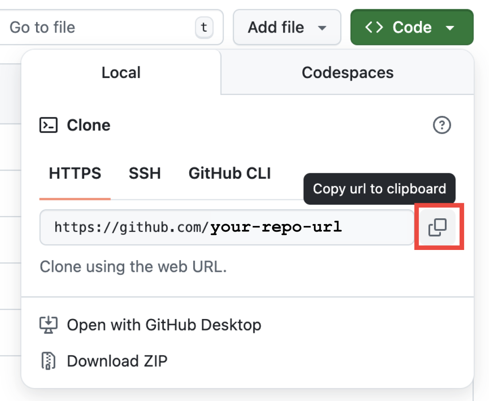

# Single Stage to Jupyter


This is a starter repository that makes it easy for others to download and run your code after you have commited it to github.

It uses github pages to host an initial dowload script, and the UV package manager for easy dependency installation.

# How this works

<!-- QUICK_INSTALL_START -->

Once configured and published, anyone can bootstrap your analysis with:

    curl -fsSL https://<your-github-username>.github.io/<your-new-repo>/dl.sh | bash

This line is auto-generated by `create_command.sh` after you personalize the repo.

Running this command will clone the repo, install dependencies, and ask if you'd like to start up a jupyter server.

<!-- QUICK_INSTALL_END -->

# How to use this template

1. In the upper right corner of this github page, press "Use this template"

## Getting started (for template users)

Follow these steps to create your own one-line-downloadable analysis repository from this template.

1. Click "Use this template" on GitHub to create your repo from this template.
2. Clone the new repo locally:

```zsh
git clone https://github.com/<your-github-username>/<your-new-repo>.git
cd <your-new-repo>
```

Or, copy the clone link from your new repo's gui link here:



3. Add your analysis code and assets in the repository. Recommended structure:

- `data/` — small demonstration datasets (avoid shipping large raw data in git)
- `src/` — analysis scripts and modules
- `install_and_sync.sh` — the repo-specific install + setup script (already present)
- `dl-util/dl.sh` — the downloadable bootstrap script (generated for you)

4. Personalize and generate the one-liner that will appear in your README and be hosted on GitHub Pages:

```zsh
chmod +x create_command.sh
./create_command.sh --user <your-github-username> --repo <your-new-repo> [--domain your.custom.domain] --yes
```

This will update `dl-util/dl.sh`, `dl-util/index.html`, `dl-util/repo_url.txt`, and the README Quick Install block with the correct URL.

5. Commit and push the changes to GitHub:

```zsh
git add .
git commit -m "Configure Pages one-liner and bootstrap files"
git push origin master
```

6. Wait for the GitHub Actions workflow ("Deploy dl.sh to GitHub Pages") to run and publish `dl-util/` to Pages. Once it finishes, your `dl.sh` will be available at:

```
https://<your-github-username>.github.io/<your-new-repo>/dl.sh
```

and your README will show the one-liner such as:

```
curl -fsSL https://<your-github-username>.github.io/<your-new-repo>/dl.sh | bash
```

## Checklist (what to do after using this template)

- [ ] Add your analysis code and small example data
- [ ] Verify `install_and_sync.sh` correctly installs dependencies and launches any long-running services appropriately (e.g., Jupyter Lab)
- [ ] Run `./create_command.sh` to personalize the one-liner
- [ ] Commit and push changes to GitHub
- [ ] Confirm the `Deploy dl.sh to GitHub Pages` workflow completes successfully in Actions
- [ ] Use the one-liner from the README to validate a fresh clone on another machine

## Recommended practices and notes

- Use the piped one-liner (`curl ... | bash`) to avoid leaving `dl.sh` on the user's machine. If you prefer to save the script first, provide the alternate command in the README and explain the temporary file approach.
- Keep `dl-util/dl.sh` simple and safe: it should primarily clone/pull your repo and run the trusted `install_and_sync.sh` found inside the repo. Avoid storing secrets in the repo.
- For transparency, include the contents of `install_and_sync.sh` in the repository root and consider adding a brief SHA256 hash near the one-liner so advanced users can verify the downloaded file.

## Integrity check (optional)

To verify the downloaded `dl.sh` before running it, compare its SHA256 hash:

Expected SHA256 will be included automatically in the short project README and on the Pages landing after you run `./create_command.sh`.

Compute/verify locally (macOS example):

```zsh
curl -fsSL https://<your-github-username>.github.io/<your-new-repo>/dl.sh -o /tmp/dl.sh \
    && shasum -a 256 /tmp/dl.sh
```

Compare the output to the SHA shown in your short README or Pages landing. The hash will change when `dl.sh` changes.

## Security reminder

Anyone running a remote script should review it first. Provide the command both as the quick pipe (convenient) and as a link to `dl.sh` so users can inspect it before running.
