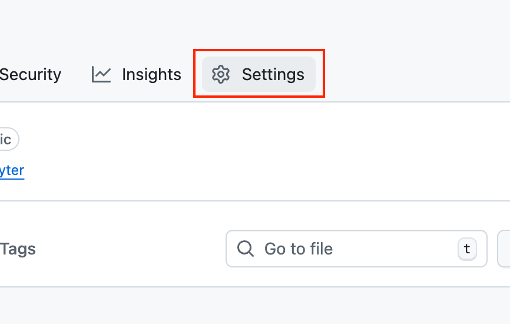
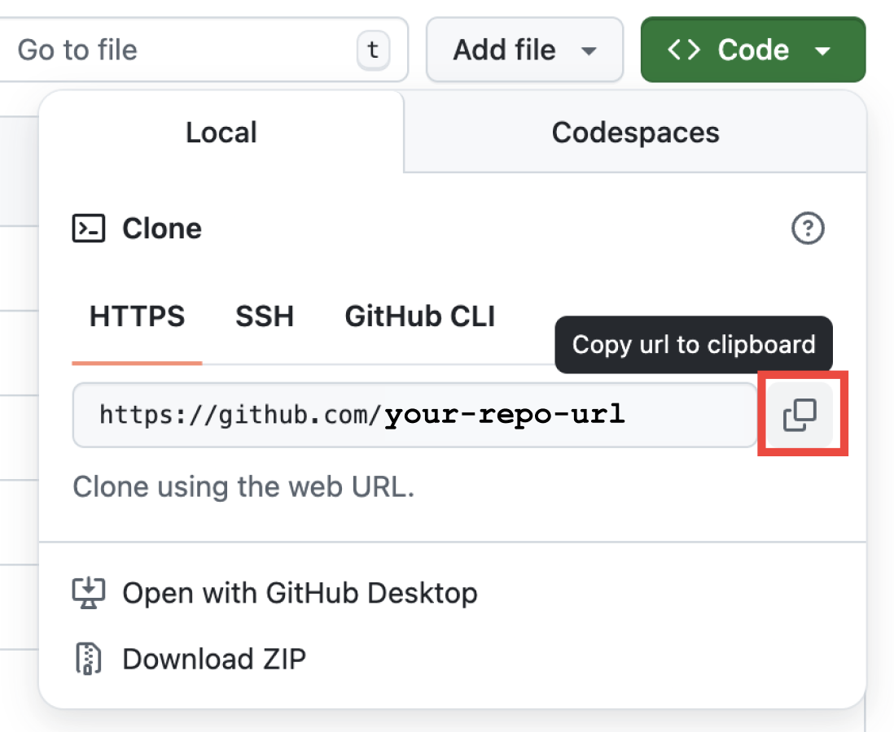

This is a starter repository that makes it easy for others to download and run your code after you have commited it to github.

It uses github pages to host an initial dowload script, and the UV package manager for easy dependency installation.

# How this works

<!-- QUICK_INSTALL_START -->

Once configured and published, anyone can bootstrap your analysis with:

    curl -fsSL https://<your-github-username>.github.io/<your-new-repo>/dl.sh | bash

This line is auto-generated by `initialize_repo.sh` after you personalize the repo.

Running this command will clone the repo, install dependencies, and ask if you'd like to start up a jupyter server.

<!-- QUICK_INSTALL_END -->

# How to use this template

1. In the upper right corner of this github page, press "Use this template"

## Getting started (for template users)

Follow these steps to create your own one-line-downloadable analysis repository from this template.

1. Click "Use this template" on GitHub to create your repo from this template.
2. Enable github pages from github actions.

- Click settings:
- Click "Pages" on the left side, then click "Github Actions" from the dropdown labeled "Source" 

3. Clone the new repo locally:

   ```zsh
   git clone https://github.com/<your-github-username>/<your-new-repo>.git
   cd <your-new-repo>
   ```

   Or, copy the clone link from your new repo's gui link here:

   

4. Add your analysis code and assets in the repository. Recommended structure:

- `data/` — small demonstration datasets (avoid shipping large raw data in git)
- `src/` — analysis scripts and modules

4. Personalize and generate the one-liner that will appear in your README and be hosted on GitHub Pages:

```zsh
chmod +x initialize_repo.sh
./initialize_repo.sh
```

This will walk you through a few steps to customize the link to your repo.

You may also use a lone-liner with all your details entered:

```zsh
./initialize_repo.sh --user <your-github-username> --repo <your-new-repo> [--domain your.custom.domain] --yes
```

This will update `dl-util/dl.sh`, `dl-util/index.html`, `dl-util/repo_url.txt`, and generate a README customized for your project with the download and install link.

5. Commit and push the changes to GitHub:

```zsh
git add .
git commit -m "Configure Pages one-liner and bootstrap files"
# Push main (default branch)
git push -u origin main
```

6. Wait for the GitHub Actions workflow ("Deploy dl.sh to GitHub Pages") to run and publish `dl-util/` to Pages. Once it finishes, your `dl.sh` will be available at:

```
https://<your-github-username>.github.io/<your-new-repo>/dl.sh
```

and your README will show the one-liner such as:

```
curl -fsSL https://<your-github-username>.github.io/<your-new-repo>/dl.sh | bash
```

## Integrity check

The generated and customized project supports SHA256 hash verification, as it requires running running scripts on your machine initiated by the single download-and-install command.

To verify the downloaded `dl.sh` before running it, compare its SHA256 hash:

Expected SHA256 will be included automatically in the short project README and on the Pages landing after you run `./initialize_repo.sh`.

Compute/verify locally (macOS example):

```zsh
curl -fsSL https://<your-github-username>.github.io/<your-new-repo>/dl.sh -o /tmp/dl.sh \
    && shasum -a 256 /tmp/dl.sh
```

Compare the output to the SHA shown in your short README or Pages landing. The hash will change when `dl.sh` changes.

## Security reminder

Anyone running a remote script should review it first. Provide the command both as the quick pipe (convenient) and as a link to `dl.sh` so users can inspect it before running.

## Still worried about running untreusted shell scripts?

You can install and use [vet](https://github.com/safedep/vet) in combination with this template repository. [Todo: experimental]
