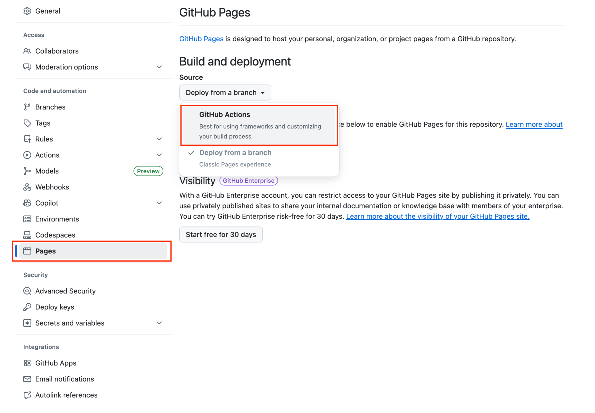

Do you ever find yourself with some Jupyter notebooks or Python files that you want to give to a colleague, but you think they might have trouble setting up their environment or installing dependencies? By starting your Python projects and analysis with this template, you can share a single download-and-install command that takes them straight from terminal to a functioning Jupyter notebook. No complex setup required.

This template uses GitHub Pages to host a download script and the [uv package & project manager](https://docs.astral.sh/uv/) for seamless dependency installation. While it's configured to initialize and launch Jupyter Lab by default, it's useful for sharing any Python code with minimal setup required.

# How this works

<!-- QUICK_INSTALL_START -->

Once configured and published, anyone can bootstrap your analysis with:

    curl -fsSL https://<your-github-username>.github.io/<your-new-repo>/dl.sh | bash

This line is auto-generated by `initialize_repo.sh` after you personalize the repo.

Running this command will clone the repo, install dependencies, and ask the user (like your friend or colleague) if they would like to start up a Jupyter server.

<!-- QUICK_INSTALL_END -->

_⚠️ Aren't remote-script installers like this a security risk?_

Yes, single-line installers like this download a script and immediately run it. This is why you should only use one if you trust the publisher of the repository hosting it.

## Getting started (for template users)

Follow these steps to create your own single-line downloadable analysis repository from this template.

1. Click "Use this template" on GitHub to create your repo from this template.
2. Enable GitHub Pages from GitHub Actions.

   - Click settings:
   - Click "Pages" on the left side, then click "GitHub Actions" from the dropdown labeled "Source" 

3. Clone the new repo locally:

   ```zsh
   git clone https://github.com/<your-github-username>/<your-new-repo>.git
   cd <your-new-repo>
   ```

   Or, copy the clone link from your new repo's GUI link here:

   

4. Add your analysis code and assets in the repository. Recommended structure:

   - `data/` — small demonstration datasets (avoid shipping large raw data in git)
   - `src/` — analysis scripts and modules

5. Personalize and generate the one-liner, which will appear in your README and be hosted on GitHub Pages:

   ```zsh
   chmod +x initialize_repo.sh
   ./initialize_repo.sh
   ```

   This will walk you through a few steps to customize the link to your repo.

   You may also use a one-liner with all your details entered:

   ```zsh
   ./initialize_repo.sh --user <your-github-username> --repo <your-new-repo> [--domain your.custom.domain] --yes
   ```

   Windows (PowerShell) template authors can run the equivalent initializer:

   ```powershell
   # PowerShell 7+
   pwsh -NoProfile -File .\initialize_repo.ps1

   # Or non-interactive with parameters
   pwsh -NoProfile -File .\initialize_repo.ps1 -User <your-github-username> -Repo <your-new-repo> [-Domain your.custom.domain] -Yes

   # Windows PowerShell 5.1 alternative (interactive)
   powershell -NoProfile -ExecutionPolicy Bypass -File .\initialize_repo.ps1
   ```

   This will update `dl-util/dl.sh`, `dl-util/index.html`, `dl-util/repo_url.txt`, and generate a README customized for your project with the download and install link.

6. Commit and push the changes to GitHub:

   ```zsh
   git add .
   git commit -m "Configure Pages one-liner and bootstrap files"
   # Push main (default branch)
   git push -u origin main
   ```

7. Wait for the GitHub Actions workflow ("Deploy dl.sh to GitHub Pages") to run and publish `dl-util/` to Pages. Once it finishes, your `dl.sh` will be available at:

   ```
   https://<your-github-username>.github.io/<your-new-repo>/dl.sh
   ```

   and your README will show the one-liner such as:

   ```
   curl -fsSL https://<your-github-username>.github.io/<your-new-repo>/dl.sh | bash
   ```

## Using uv for proper dependency management

You can learn more [here](https://docs.astral.sh/uv/guides/projects/) about how to work on Python projects with uv so that all your dependencies are tracked and easily installable by other users of your code.

### uv cheat sheet:

- Add a Python package with `uv add <package-name>`
- Create a local virtual environment `.venv` from the `uv.lock` and `pyproject.toml` files.
- Run a Python file using the local environment with `uv run <python-file>`
- Run a Jupyter Lab server using the local environment with `uv run --with jupyter jupyter lab`

## Integrity check

The generated and customized project supports SHA256 hash verification, as it requires running scripts on your machine initiated by the single download-and-install command.

To verify the downloaded `dl.sh` before running it, compare its SHA256 hash:

Expected SHA256 will be included automatically in the short project README file and on the Pages landing after you run `./initialize_repo.sh`.

Compute/verify locally (macOS example):

```zsh
curl -fsSL https://<your-github-username>.github.io/<your-new-repo>/dl.sh -o /tmp/dl.sh \
    && shasum -a 256 /tmp/dl.sh
```

Compare the output to the SHA shown in your short README file or Pages landing. The hash will change when `dl.sh` changes.

## Security reminder

Anyone running a remote script should review it first. Provide the command both as the quick pipe (convenient) and as a link to `dl.sh` so users can inspect it before running.

## Still worried about running untrusted shell scripts?

You can install and use [vet](https://github.com/safedep/vet) in combination with this template repository. [Todo: experimental]

## Todo:

- test and support single-line install with `vet`
- provide tooling for auto-download of Figshare datasets
